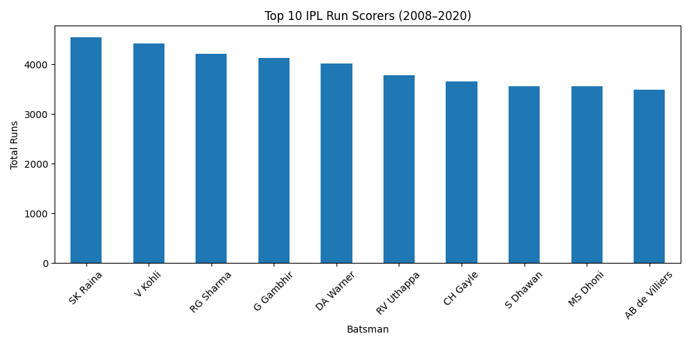

# IPL Performance Dashboard 🏏📊

This project analyzes IPL (Indian Premier League) data using Python to understand player and team performance from 2008 to 2020. The goal is to create visual insights using real-world datasets, and build skills in data cleaning, analysis, and storytelling.

## 📁 Folder Structure

<pre>
 ipl-dataanalysis-dashboard/
├── data/ → Contains CSV files like matches.csv, deliveries.csv 
├── notebook/ → Jupyter notebooks with EDA and visualizations 
├── visuals/ → Exported graphs and plots 
├── README.md → You’re reading it right now!
└── requirements.txt → Python libraries used (e.g. pandas, matplotlib, seaborn)
 </pre>

## 🔧 Tools & Libraries Used
- Python
- Pandas
- Matplotlib / Seaborn
- Jupyter Notebook

## 📌 Key Analyses (Planned / In Progress)
- Top Run Scorers
This analysis identifies the top 10 batsmen in IPL history based on total runs scored.
Ball-by-ball data was used, and only `batsman_runs` were considered to exclude extras
and accurately measure individual batting performance.

**Key Insight:**
Suresh Raina emerges as the highest run scorer, highlighting his consistency across
multiple IPL seasons. Players like Virat Kohli and Rohit Sharma closely follow,
indicating long-term performance rather than short peak seasons.

## 📂 Dataset Source
- [Kaggle - IPL Complete Dataset 2008–2020](https://www.kaggle.com/datasets/patrickb1912/ipl-complete-dataset-2008-2020)

## ✍️ Author
Madhav Saklani  
B.Sc. Physical Sciences, ARSD College  
Email: madhavsaklani00@gmail.com
